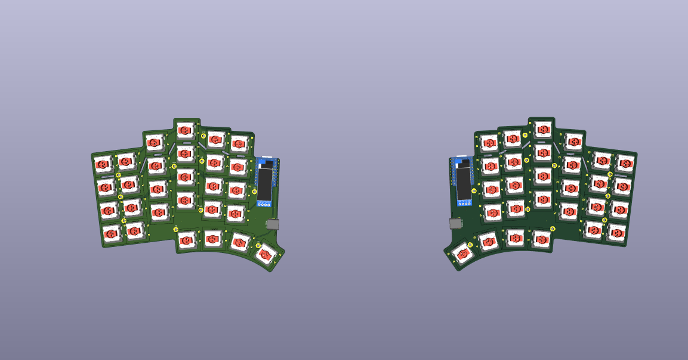

--- title: "Quaero" author: "AlwaysLearning on Slack" description: "A sleek low-profile split keyboard featuring a touchpad module." created_at: "2025-06-22" ---

**Total Time Spent: 40h 40m**

## Retro Journaling

### Similar Keyboards and Useful Resources
- [Dilemma](https://github.com/Bastardkb/Dilemma) Pretty much what I'm going for, has a touchpad, no OLED. - [Porg40](https://github.com/RaphCoder13/Porg40) touchpad on both sides - 
[Stront](https://github.com/zzeneg/stront) Very nice keeb overall, touchpad and OLED/LCD on the other side - [HillsideView](https://github.com/wannabecoffeenerd/HillSideView) has support for cirque 
touchpad - [SoflePlusX2](https://xcmkb.com/pages/plus2) Pretty much what Dad wants I guess, large keyboard with number row, no aggressive thumb cluster curve, and touchpad. - 
[Torn](https://github.com/rtitmuss/torn) I like the simplistic look and the aggressive thumb cluster look. Might be too uncomfortable though? - [Allium58](https://github.com/beekeeb/Allium58) I like the 
clean look of this keyboard more than the Lily58. Probably not good though. - [How to solder and KiCAD Hotswap Sockets](https://www.youtube.com/watch?v=H-FxFGjjxSI) - KS-33 switches can be used with 
KS-27 footprints. Nuphy switches are KS-33s. [This repo has the latter](https://github.com/ai03-2725/MX_V2) - [Joric's NRF details and alternatives github](https://github.com/joric/nrfmicro/wiki/Pinout) 
Amazing resource!.

### Brainstorming and Design Constraints
What I need: - Detachable number row. I want to use either mouse bites or v cuts to make a detachable number row. This way the PCB can be used by people who do not want to use a number layer (like my 
Dad). - Trackpad. This is a must for Dad, an optional nice (though expensive) feature for me. I do want trackpad support nonetheless. - Optional wireless support. Even though the original build with a 
trackpad can't use ZMK, I want to make a second smaller one using the remaining PCBs that is wireless. - Low profile. The handwired WordSplitter I'm currently is too clunky for my taste. I want a 
keyboard I can travel with, one that's sleek. What I want: - Maybe make it so I can add a magnetic plate that unifies the two halves and that can like snap on the top of my thinkpad keyboard, using 
small extruded rows that match the outline of the thinkpad's keys to reduce wiggling/movement. - Minimal yet sleek design. I really like the Torn and Totem keyboard's designs. Hillside's layout is also 
very nice, but I do not like the shape of its PCB at all. It just doesn't fit - Probably a vertically positioned USB-C receptacle, so I can potentially bring the splits close together. That will be 
difficult though, seeing the orientation of the MCU.
### BOM
- $4 x 2 nice!nano aliexpress clone - $38 [40 mm Cirque Trackpad](https://keycapsss.com/keyboard-parts/parts/211/glidepoint-cirque-trackpad-tm040040-tm035035) (this is 30 for the trackpad and 8 for the 
ffpc to i2c adapter)
	- $4 x 2 110 mAh (or similar) batteries. Something like this 
https://www.aliexpress.us/item/4000174322578.html?spm=a2g0o.productlist.main.11.394a75e3YVHUWd&algo_pvid=0a96b83d-ee92-4c81-9cb3-b6a51cf85bf7&algo_exp_id=0a96b83d-ee92-4c81-9cb3-b6a51cf85bf7-5&pdp_ext_f=%7B%22order%22%3A%2216%22%2C%22eval%22%3A%221%22%7D&pdp_npi=4%40dis%21RON%2134.59%2128.38%21%21%217.13%215.85%21%4021038e6617401087327352017eb96f%2112000039874499945%21sea%21RO%216269058475%21X&curPageLogUid=LsvpwRbVNrPs&utparam-url=scene%3Asearch%7Cquery_from%3A 
- $14 [Hotswap sockets (gateron low profile)](https://www.aliexpress.com/item/1005007267551458.html?sourceType=1&spm=a2g0o.wish-manage-home.0.0) - $1 x 2 [Usb C Breakout 
Board](https://ardushop.ro/ro/fire-si-conectori/1401-modul-usb-c-groundstudio-6427854000804.html) - $3 
[Diodes](https://www.aliexpress.com/ssr/300000512/BundleDeals2?spm=a2g0o.productlist.main.5.121a67ddfqVjBl&productIds=4000142272546:10000000428321629&pha_manifest=ssr&_immersiveMode=true&disableNav=YES&sourceName=SEARCHProduct&utparam-url=scene%3Asearch%7Cquery_from%3A) 
- $3 OLED - $30 ? PCB. I uploaded the stront gerber, which is similar to what I'm planning to build and that's the quote JLCPCB gave me (it includes shipping). - Keycaps: 3D printed by me - Case: 3D 
printed by me

### PCB

**Example:** The Totem's Schematic

 This is a great reference. Simple and to the point.

Positioning in KiCAD is hard. Really hard. The best way I've found to move items to create stuff such as column stagger is select a whole column, right click, positioning, position interactively. Then 
you can select like two identical corners on let's say the pinky column and ring column and create an y offset between them. Work outwards or inwards relative to the middle finger column: so first to 
create the ring finger column stagger for example set the reference point on the top right corner of the top most switch, and then the relative reference corner on the top right corner of the top most 
switch from the middle finger column, and then set the offset to like -8.5mm as on the Totem and then move onward. To measure the offset and splay and all of all the different columns and thumbkeys, 
what I did was import the Totem case top .step file into Onshape, and then I selected two of the vertices of adjacent columns: so like the top right corner of the top switch of the pinky column and the 
top *left* corner of the ring finger column. Onshape then has this nice little popup measure menu down at the bottom which tells you the angle, x, y, and z distances between your two selections. You can 
do something in OrcaSlicer/other slicer programs as well, albeit in a more difficult way (harder to select edges and vertices).


Once you have your layout (of the switches) determined in KiCAD, you can start working on the rest of the PCB, as well as the schematic. First, assign to each switch a reference, as shown here. By 
default, if you haven't already made a schematic (might be easier to just make the switches and the matrix first and then do this, but this is useful if you are using ergogen), make one and start making 
your matrix. I used S_number for my reference, as that's the default generation reference that Scotto's placeholder switch uses. It would be better to name them SWR_number/SWL_number as GeistGeist does 
in his Totem schematic though, as that way it will be easier to discern. Though that way you might have to manually rename everything in the schematic as well.


For the USB-C receptacle I'm using the 4085 THT one. KiCAD has these in it's default libraries, so that's great. It also has the 3D model for it. Speaking of 3D models: instead of using a diode from 
like ScottoKeebs library, if you use the DO-35 THT 7.62 mm pitch (just like the ammo lol) footprint which is part of KiCAD's default libraries then you don't have to manually assign a 3D model. Here's a 
great schematic I found on the Scottokeebs Discord. Credit Ben Park.


After some more research and trying out to figure how to connect both a battery and a usb c to the nrf52840, my dumb ass realized that it doesn't matter because QMK does *not* support the nrf52840 chip, 
so I can't make it wired. And as ZMK trackpad support is a mess and terribly complicated, I guess I'll just swap the supermini for a pico, and that's that. I could try and make compatible with both the 
supermini and the pico, but I'm complicating things too much and I don't have that much time left, so yeah.

Okay did some more research and talked to some guys on the Discord, and turns out that some RP2040 boards (which are compatible with QMK) have the same layout/similar pinout to the SuperMini NRF52840 
such as these: [keycapsss](https://keycapsss.com/0xCB-Helios-Pro-Micro-Elite-C-compatible-MicroController-with-RP2040/KC10205-BK), [aliexpress 
(tenstar)](https://www.aliexpress.com/item/1005006130019224.html?gatewayAdapt=4itemAdapt), and [keeb.io](https://keeb.io/products/rp2040-pro-micro-usb-c-controller). I'm worried about the pins needed 
for I2C though, as their placement might differ between the two if they are placed at the very bottom. Oh by the way, I got this from bkendall's 
[repo](https://github.com/bgkendall/keyboard_mcu_list?tab=readme-ov-file) for RP2040 MCUs, which he kindly shared with me on Discord. [Power Switch 
options](https://discord.com/channels/714176584269168732/827258620902899714/1355227023005581394) Also the battery pins in the upper left corner seem to be joined in the marbastlib footprint for the nrf, 
but they aren't for the rp2040 pro micro, so that might be an issue. I think that I'll have to remove the pin header for the second pin for the rp2040 to prevent any issues.

 [image](https://github.com/user-attachments/assets/2b2cb409-f877-41dd-bb2b-a52b944d1f80)

**Rough Estimated Time: 30h** Researching every part was a pain.


## 4/07/2025
**Time Spent: 3h 10m**


Redid the board routing. I used 15.75 mils trace width for the power, and even though I tried to avoid it I had to use one via on the trace from the +3.3V from the OLED to the MCU. For some reason the 
outlines of the teardrops used in my past version of routing are still there (look right beneath the MCU), but I can't seem to remove them and they dont't seem to do anything so I'll just ignore them. I 
now realize that instead of spending time adjusting the column and row pins in the schematic it would have been much easier to just not assign any pins of the MCU, route the matrix, and then assign the 
pins depending on how and where I could draw the traces. I also re-adjust the cutouts a bit, and did research on those as well as asked in the Keyboard Atelier server. Unfortunately, there aren't many 
keyboards with these kind of cutouts. I did find some in the Corne v4 and Hillside (admittedly for columns, not rows, but it should be pretty much the same thing). Someone on the Discord reminded me 
that if I plan to cut the material between the cutouts out with a Dremel than I need to make said distance at least as large as the disc of the Dremel, which I did not think about before. So I 
double-checked the distances to make sure there isn't anything that would be too difficult to cut. You'll notice that for I left the gaps between cutouts larger in two spaces. This is because I want to 
see if bigger pieces are that harder to cut. If they aren't, I'll use a similar distance in the future because I have more space to route stuff + the PCB will be stronger. Speaking of the PCB, the same 
person who reminded me of the disc size also told me that dust from cutting PCBs is toxic, which I had totally forgotten, so I'll have to make sure I remember to use a mask when doing so.


I've also started messing around with ground fills, but I have absolutely no idea what I'm doing. DRC error check says something about thermal relief, so I'll have to check that in the future.

## 20/07/2025
**Time Spent: 2h** Figured out how to embed images in my JOURNAL.md file, as now that I'm using nano for journaling I can't really copy-paste screenshots as I've done through the Github GUI. This took 
some time (as I'm new to git), so I have like 3-4 test commits just to see that the embed path is working. *Adding images your journal without using the github GUI:* Create a folder called "pics" (or 
whatever), add your screenshots there (don't be stupid and make your life harder by adding a space in the file name as I did lol), and then whenever you want to embed a picture into your journal you can 
just use ":


## 24/07/2025
**Time Spent: 5h 30m **

Still stuck at routing...it's a pain. I want to make it look neat, but at the same time I don't want to like waste a lot of time on making the routing symmetrical and everything when it's mostly not 
going to be seen. I keep looking at other boards for "ideas", but they are either extremely minimal and tidy or super cluttered, and a lot of them don't have splay as I do, which leads to the routing be 
different. I'm currently routing the columns to the MCU (I've decided that I'll do all the main "rough routing" and then mess around with actually connecting the ends to the pins), and I just made a 
mistake (which I think) is pretty funny:

So when using the Gruvbox theme, the front traces are this copper/gold color and the back traces are grey. Now, This grey is not very different from the white used for the silkscreen stuf of the 
footprints, and my rather tired eyes mistook the silkscreen outline of the key for a column haha...and now I was confused about why my via didn't seem to work. I might switch to Solarized for the theme 
tbh just because it's kind of hard to see stuff (too little contrast).

I'm switching the footprint and symbol for NRF52840 pro micro to the RP2040 pro micro, even though they are kind of compatible. Now that I have decided that I won't be trying to make it wireless 
compatible as well it would be pointless to use the footprint for the nrf52840, as I wouldn't be able to use it at all. Plus the RP2040 Pro Micro has some more pins at the bottom which will make routing 
slightly easier. Though now that I think of it routing power traces will be harder because of those extra pins, so yeah I might have just made my life harder instead of easier. The footprint and symbol 
for the RP2040 Pro Micro is included in the ScottoKeebs library by the way. Ok scratch that I just realized that I can actually use a [RP2040 
Zeros](https://www.aliexpress.com/item/1005006865919374.html?spm=a2g0o.order_list.order_list_main.5.22431802HWxVuf#nav-specification), which is both smaller and cheaper. Plus I already have one from Ali 
which works, so yeah. And damn I need to stop trying to perfect and optimize everything because I'm wasting quite a bunch of time on research and double-checking. Got the footprint for it from the 
ScottoKeeb library as well.

Updated everything (footprints + schematic, and optimized the latter a bit), but now I'm facing a new issue: the RP2040 Zero is shorter, and I've routed my columns through the bottom part, and now I 
either have to redo them all through the middle or extend the traces upward, which is totally unecessary and messy. I'll do a commit before doing that though, just to be sure.

So I've spent a lot of time trying to figure out if what I'm doing with the USB C receptacle is correct. I asked in the KiCAD discord, and there they said that I should not put RX and TX to D+ and D-, 
but rather to SBU1 and SBU2. I don't know why, I'll have to look that up as well. I'm trying to figure out what I need for the OLED on the left side as well as the Cirque trackpad on the right to 
communicate properly with the MCU. I'll have to do some more research on I2C, and what I just saw on the QMK docs was worrisome (something to do with pullup resistors, which I do not understand yet): 
[split keyboard considerations](https://docs.qmk.fm/features/split_keyboard#considerations).
 [image](pics/pic_5.png)


## 25/07/2025
**Time Spent: 3h 40m**

Asked in the QMK discord, and it turns out that my worries were misfounded: if I have an OLED on both sides I don't need to use I2C to communicate between the two halves for both to work, so that means 
I don't need to deal with the hassle of adding pullup resistors and all that. I initially thought that the slave half would be the master to its own OLED and slave to the master half, which is wrong. 
Here's a diagram provided by a member of the Discord which made things click for me: ``` OLED <=> I2C <=> MCU1 -----(split serial)----- MCU2 <=> I2C <=> OLED ```

Now I need to add the mounting holes, finish routing the left side, and then move on to the right side. I asked in the KiCAD Discord why people add mounting holes in their schematic instead of just 
adding the footprint directly to the PCB, and it seems that is because it's considered good practice to make sure that you add every component in your PCB to your schematic, as when cleaning things up 
later you might forget that a component which is not in the schematic is important and delete it. Plus, adding it your schematic allows you to connect the mounting pad to ground, which again is good 
practice.

I just realized that putting RX and TX on the SBU1 and SBU2 pins as the guys on the KiCAD discord suggested means that if the cable is not plugged in the right orientation the keyboard won't work. So 
I'll just go with the more unorthodox (from the "stick to the specs" viewpoint at least) approach and connect the two D- and two D+ into pairs and then like assign TX to the D+ pair and RX pair, as I 
had done initially.

I just realized I might not be able to make a plate because my layout isn't in KLE/Ergogen, and after freaking out and despairing a bit I started scouring the internet for a solution. I could just make 
the PCB black and not use a plate, and have a more open design (such as the Piantor for example), but I think that's rather unpolished, so tbh I don't really like that. After about 40m of research, I 
kind of gave up and asked on the Absolem Discord, where I got a response with a valid solution! Speaking of Discord, I do wish it had a better search engine incorporated or something. Here's what the 
solution "copy-paste pcb file, replace switch footprints with cutouts, remove all other components (didodes, mcu, etc)." I'll figure out how to do this tomorrow.

Today was mostly refining my routing and double-checking for errors. I also think I've succesfuly solved a very worrisome issue: because the key's are rotated (splay), if I mirror the left half and then 
flip each key indvidually, the rotation is in the opposite direction, messing everything up. A solution is to flip each key in the footprint editor, and now I only have to find out how to apply that 
edit to a group of the same footprints at once and boom: problem solved! Here's where I'm currently at: 

## 26/07/2025
**Time Spent: 4h **

*Quick Tip:* If you want to search for keyboards based on a certain filter, eg. using the RP2040 Zero (like I did: was looking for inspo regarding OLED and headers), then [yal's ergo keyboard 
list](https://yal-tools.github.io/ergo-keyboards/) is a great resource.

Most of today was struggling with the footprints and the outline. I found a model for the ks33 switch on GrabCAD, and then I had to find out how to update the whole board. Turns out in KiCAD you can't 
update a bunch of the same footprints at once: you can either do them one by one or you have to update the global footprint. So I updated the latter and then reloaded the app. I had issues with the 
footprints for the RP2040 Zero and the OLED as well: the 3D models were nowhere to be seen, even though the Scotto library had them. I assigned them manually, and then realized that the reason that they 
didn't show up was because when I downloaded the library I named the folder "SCOTTOKEEBS_KiCAD", using a lowercase "i" for the KiCAD instead of a capital "I" as in the original name of the folder. This 
caused automatic path to fail. Dumb error on my part, but well you live and you learn. I also had to re-position the 3D models for both the RP2040 and the OLED, as when importing them they were both 
offset. Messing with these two led me to realize that the OLED would be really high if I placed it above the RP2040 (which would be mounted with headers) as I had planned. I should have flipped it and 
found some other way to mount it. Might change that in the following days.

The outline was hell. I spent like an hour and something trying to make just by eye and changing the grid size in KiCAD, but eventually I gave up. I took a screenshot of the keyboard, imported it into 
Onshape, brought it up to scale, drew some construction lines on the top of the angled switch columns for reference, and then made the outline. I created a variable for the dimensions of the outline, 
which turned out to be very useful when I decided I wanted the distance between the edge of the switch footprints and the edge of the PCB to be 1.5 mm and not 1 mm. It was tedious, but not as much as it 
would have been had I persisted in trying to finish it in KiCAD. Had to do several iterations obviously. Oh and when exporting, Onshape sets the default units to "meters", not millimeters, so when 
importing the .dxf into KiCAD all I got was a small blob. Took me a while to figure that out.
 [image](pics/pic_10.png) [image](pics/pic_11.png)
## 29/07/2025 
**Time Spent: 3h**

Turns out that when importing a .dxf, all the segments are grouped, so if you want to edit it inside KiCAD you need to either enter the group or ungroup them. I had made the USB-C cutout for the RP2040 in the footprint editor (if its flipped with standard headers the USB-C receptacle collides with the PCB underneath), and I could not for the life of me figure out how to "incorprate" said cutout with the existing outline on the Edge.Cuts layer. After finding out about the grouping thing I just mentioned, I messed around a bit and connected the cutout from the footprint to the outline, thus finally getting rid of that annoying "board outline malformed" error. This took abou an hour of head-bashing but at least now I know.

Did some more refining on the traces (especially those around the MCU), and then moved on to figuring out how to add a ground fill. It seems that once you have a ruled edge/area outline  you have to press "B" to actually build the fill. After doing some more asking around in the KiCAD Discord, I found out that I need ground vias to connect the bottom and top ground layers. "Stiching vias" they are called. Here's where to place them, according to someone from said Discord "It's good practice to stick them next to other non-ground vias, around breaks in the ground plane on either side, in corners, along edges, at the ends of stubs, and then every so often in the middle of large patches." I just sprinkled some around the board to make sure there aren't any islands and that's that. I also had some errors regaring "thermal releif" and "min spokes connected to ground pads" or something like that for the USB-C mounting pads. 


## 30/07/2025
**Time Spent: 6h 40m **

Today was all about going crazy trying to figure out how to mirror the damn thing. I initially thought I had found an easy way: copy the whole thing, flip it, and then just flip the indvidual components in footprint editor and then save. But, turns out not all components (USB-C, OLED, and MCU) were perfectly centered in the footprint editor, so flipping them there would result in a change in their original position. And flipping the switches inside the footprint editor obviously modified the footprint, but because it modifed the footprint itself and not the footprint as whole on the board the 3D models for the hotswap sockets and switches remained in their original position: that is, on the other side of the board. I then also messed around with the built-in "mirror", but that does not work on footprints for obvious reasons. Eventually, after many hours and asking around in multiple Discords, I figured out a workaround. First of all, I copied and flipped the left side, and then for each switch and diode I selected them, flipped, them, and rotated them by double the number of degrees of their original position. So if a switch was rotated by 7, after flipping I'd rotate it by 14, -3 by -6, and so on. For the OLED and USB-C and MCU this technique did not work, as in the footprint editor they were all too offset from their center. So for those I just copied each one, flipped it, rotated by however many degrees the original one was, manually placed it exactly on top of the original, and then  deleted the original from underneath. 



After that I manually reassigned the references for each component on the right side and then made schematic for the latter. I also started doing the routing. 

## 31/07/2025
**Time Spent: **
Finished the routing, ground fill, and also cleared up all the errors (had quite a few). 


