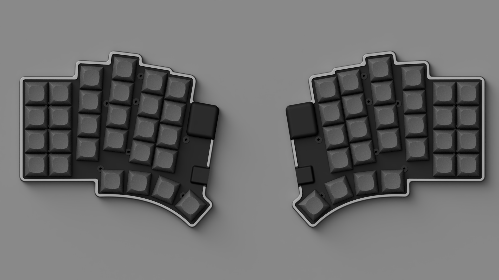
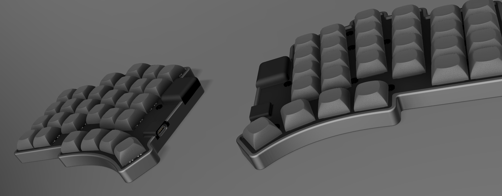
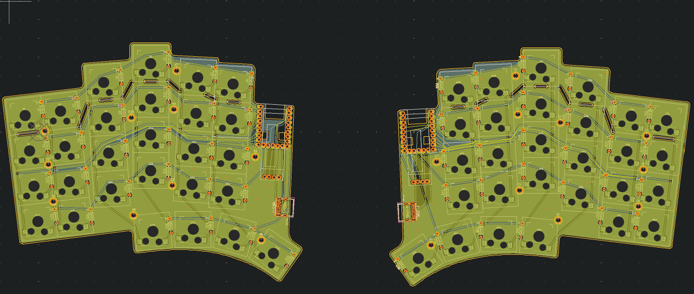
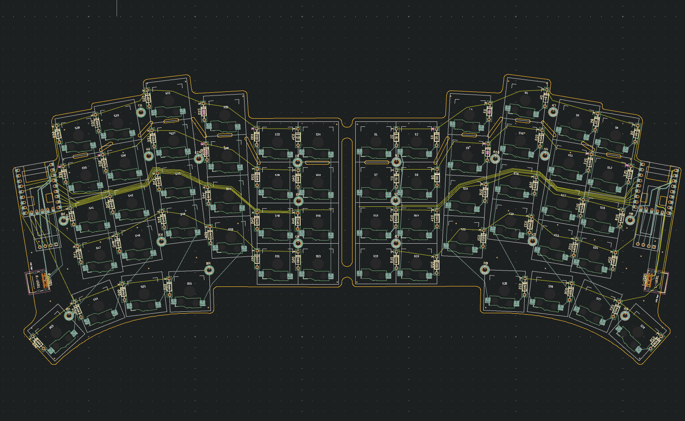
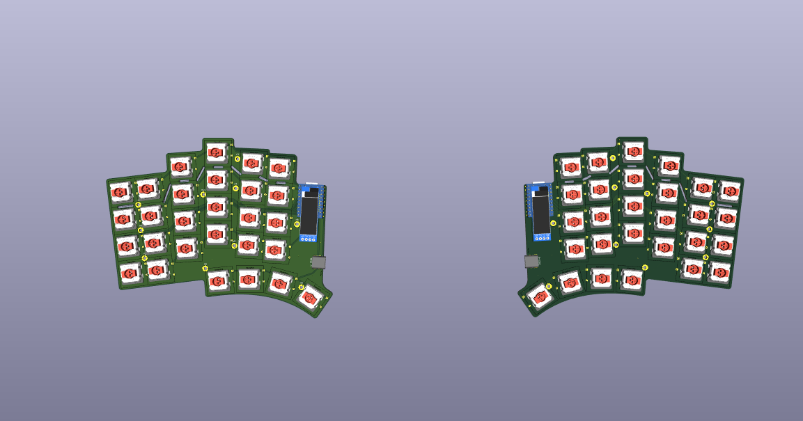

# Quaero
*"quaero" - Latin verb meaning "I seek", "I am looking"*  
As the name suggests, this is a keyboard designed to help the daily 'seeking' through the internet, making typing more efficient and comfortable.  
  
# Key Features
- Uses low-profile affordable Gateron KS-33 switches  
- PCB is compatible with an OLED and Cirque touchpad (with an I2C adapter)  
- Removable number row  
- Ergonomic splay and thumb clusters  
- Hotswappable
  
# Gallery 

  

  
# License
Quaero is licensed under CERN-OHL-P-2.0.

